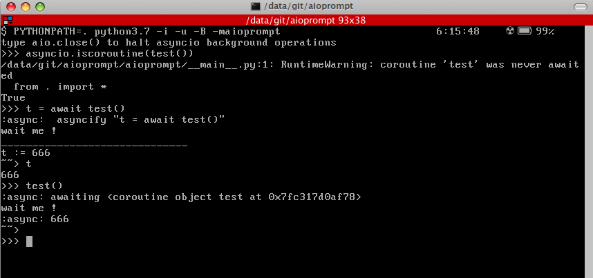
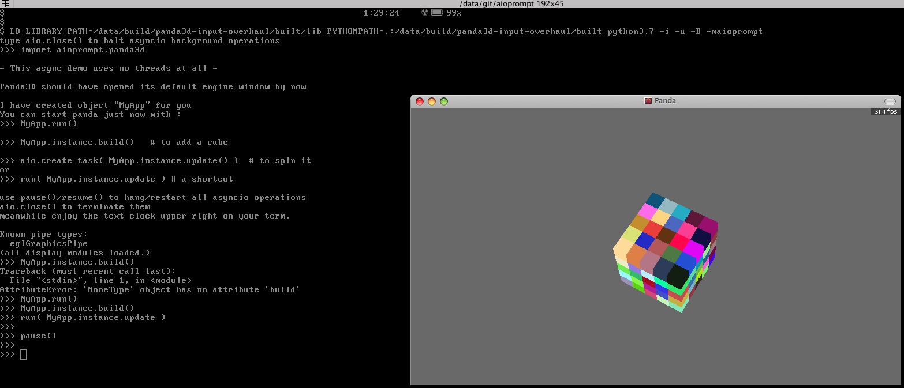

# aioprompt

minimal py3.6+ repl for asyncio using **readline module** tricks. That module is often available on GNU/Linux platform.

tests are made on 3.7, but 3.6 should be fine too except for certains "await" syntax use. eg f'{await test()}' would not work on 3.6


Testing:

```
$ git clone https://github.com/pmp-p/aioprompt.git
$ cd aioprompt
$ PYTHONPATH=. python3.7 -i -maioprompt
```

The main test will launch a clock on your repl ( use a VT100 utf-8 compatible terminal ).



aio.* ( which actually is the asyncio loop) namespace provides pause/resume/step/run functions to control async loop
 and add coroutines.

you can also import them in repl with from aioprompt import * and use them directly

"loop", "close", "create_task", "pause", "resume", "step"

"schedule" is a special function that mimic micropython.schedule function using PyOS_InputHook from readline module.

to add a task just use : aio.create_task( the_task() )
or run(the_task)

## Panda3D

if you have Panda3D engine installed, you can try it async with:

```
>>> import aioprompt.panda3d
```



Quite usefull via ssh for debugging fullscreen game, or simulating Panda3D webgl browser port on your desktop !

refresh rate will be slow but that's expected, actually cpython readline module does not allow to set it

see https://bugs.python.org/issue35243

## known bugs
multiline triple """ ''' """ quoted str would fail because not using decent parser.

## LATER:
  maybe use linenoise-ng ( MIT ) as a C readline replacement and mimic window.requestAnimationFrame() from javascript.

  add a C function to set refresh rate in a timely manner ( microcontroller style ).

  add to H3Droid python3.7 interpreter as a PYTHONSTARTUP script.

